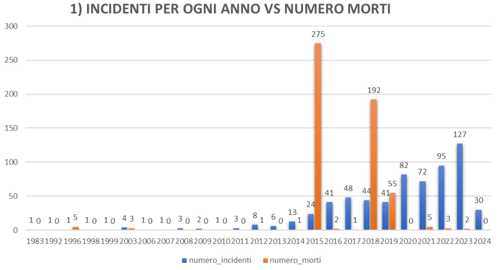
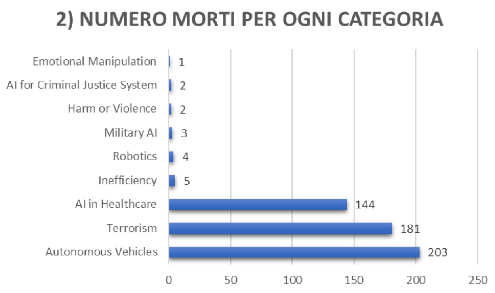
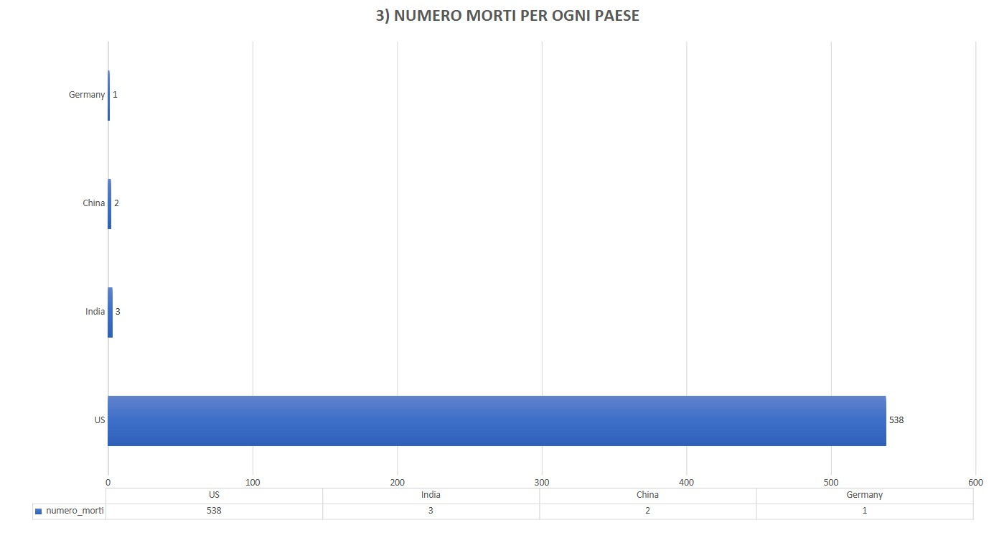
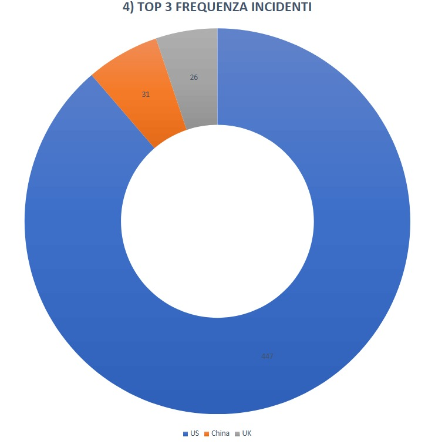
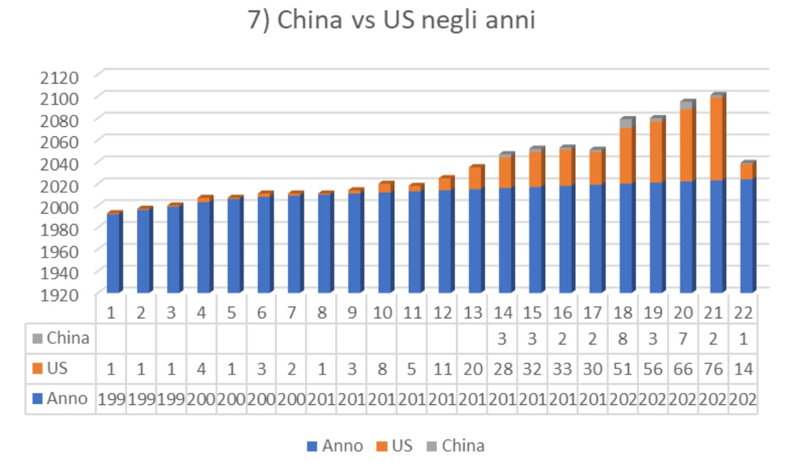
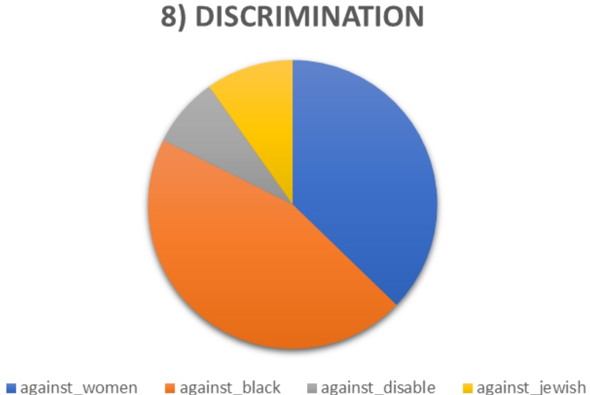
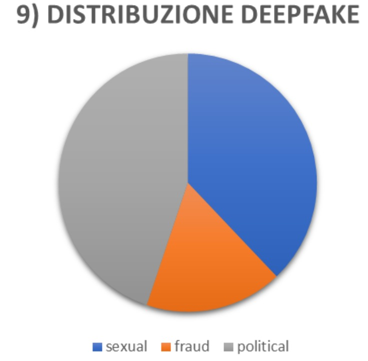
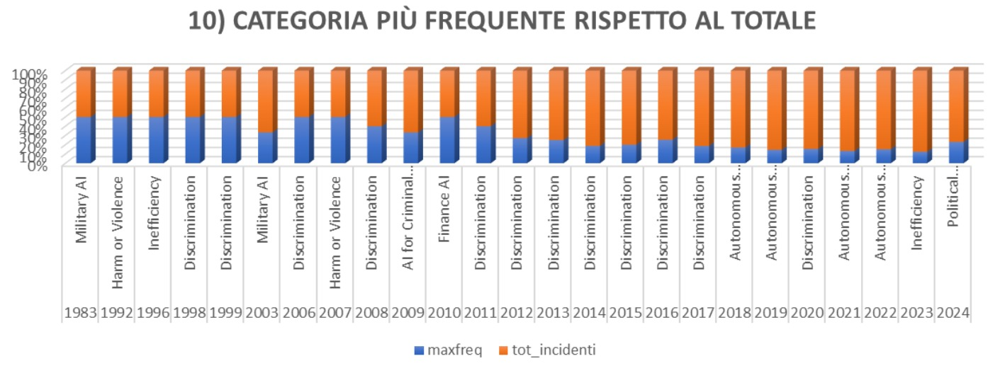

# AI Incident Database Analysis using SQL

## Overview

This project presents an SQL-based analysis of a relational database containing publicly documented Artificial Intelligence (AI) incidents.

The objective is to investigate temporal trends, geographical distribution, incident categories, AI-related fatalities, discrimination issues, and deepfake-related events using SQL queries executed on a PostgreSQL database.

The project demonstrates practical skills in relational database analysis, data aggregation, complex SQL querying, and analytical reporting.

---

## Project Summary

Artificial Intelligence is increasingly integrated into critical sectors such as healthcare, transportation, finance, defense, and public administration. Alongside its rapid adoption, AI systems have also generated incidents involving safety failures, discrimination, misinformation, privacy violations, and fatalities.

This project analyzes a structured database of AI-related incidents to identify patterns, trends, and ethical challenges through SQL-based data exploration.

The entire analysis was performed using PostgreSQL and focuses on extracting meaningful insights from real-world incident data.

---

## Project Objectives

- Analyze the evolution of AI-related incidents over time.
- Identify countries with the highest number of reported incidents.
- Examine AI-related fatalities across different categories.
- Compare AI incident trends between the United States and China.
- Investigate discrimination-related incidents affecting different target groups.
- Analyze the distribution of deepfake incidents.
- Identify the most frequent AI incident category for each year.

---

## Database Structure

The relational database contains information about:

- AI incidents
- Incident categories
- Countries
- Fatalities
- Victims
- Deployers
- Incident descriptions

The analysis includes:

- INNER JOIN
- LEFT JOIN
- Aggregate Functions
- GROUP BY
- Nested Subqueries
- Window Functions
- Filtering with LIKE
- Sorting and Ranking

---

## Dataset

The dataset contains publicly documented AI incidents collected from multiple open sources.

Each record includes:

- Incident date
- Country
- Incident category
- Description
- Victims
- Number of deaths
- Deployer

---

## SQL Analysis

The project includes analyses of:

1. AI incidents by year
2. Deaths by incident category
3. Deaths by country
4. Top 3 countries by number of AI incidents
5. Average deaths by country
6. Child victims and deployers
7. AI incident comparison between the United States and China
8. Discrimination incidents by target group
9. Deepfake incident distribution
10. Most frequent AI incident category by year

---

## Key Findings

- AI-related incidents have increased significantly over the last decade.
- The United States records the highest number of documented AI incidents.
- AI-related fatalities are concentrated in a limited number of application domains.
- Discrimination represents one of the most recurring ethical concerns.
- Deepfake incidents are mainly associated with political manipulation, sexual exploitation, and fraud.
- The dominant AI incident categories have evolved considerably over time.

---

# Visualizations

## AI Incidents vs Deaths by Year

Comparison between the annual number of AI incidents and reported fatalities.

---

## Deaths by Incident Category

Distribution of fatalities across AI incident categories.

---

## Deaths by Country

Countries with the highest number of AI-related deaths.

---

## Top 3 Countries by Number of AI Incidents

Countries reporting the highest number of documented AI incidents.

---

## United States vs China

Comparison of AI incident frequency over time between the United States and China.

---

## Discrimination Incidents

Distribution of discrimination-related incidents by target group.

---

## Deepfake Incident Distribution

Distribution of deepfake incidents by primary purpose.

---

## Most Frequent Incident Category by Year

Most frequently reported AI incident category for each year.

---

## Technologies

- PostgreSQL
- SQL
- Relational Database Design
- Data Analysis
- Data Visualization

---

## Skills Demonstrated

- SQL Querying
- Complex Joins
- Nested Subqueries
- Window Functions
- Data Aggregation
- Filtering and Ranking
- Trend Analysis
- Analytical Reporting
- Relational Database Design

---

## Dataset Availability

This dataset is provided for educational and research purposes only.

---

## Author

**Sofia Rubini**

Bachelor's Degree in Philosophy and Artificial Intelligence

Sapienza University of Rome
